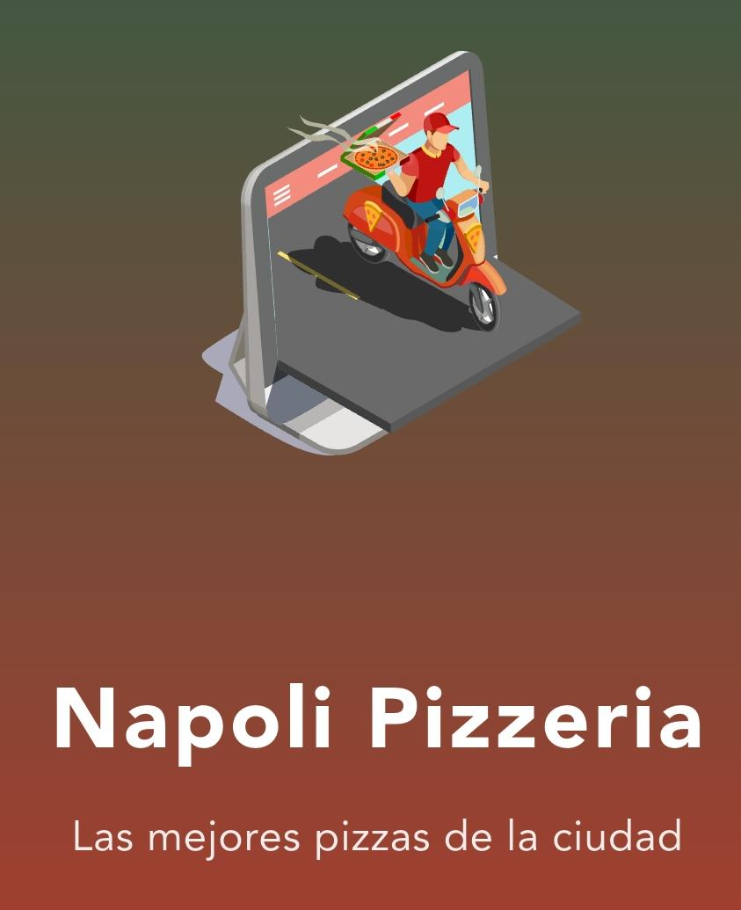
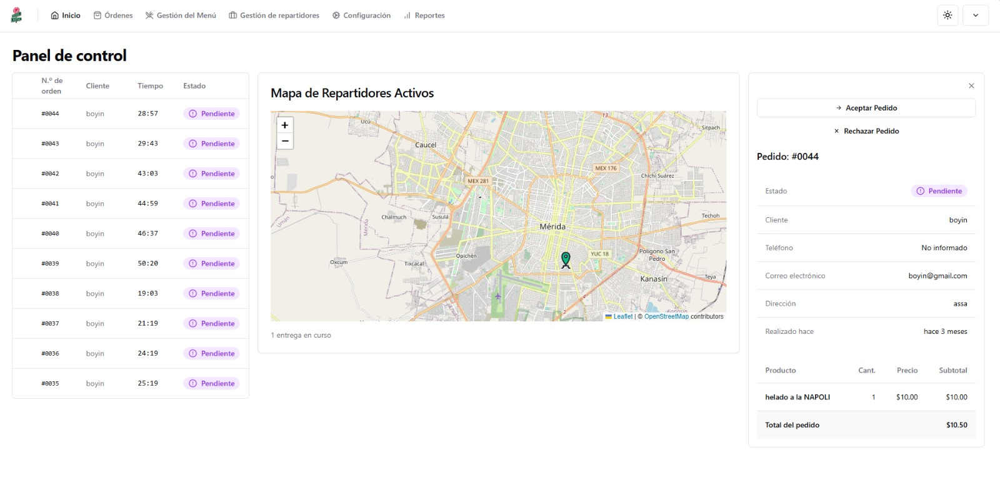
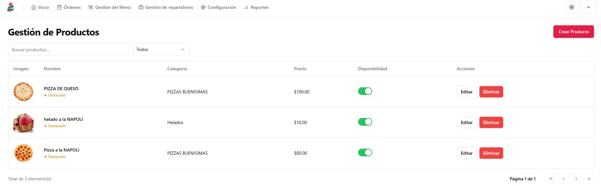
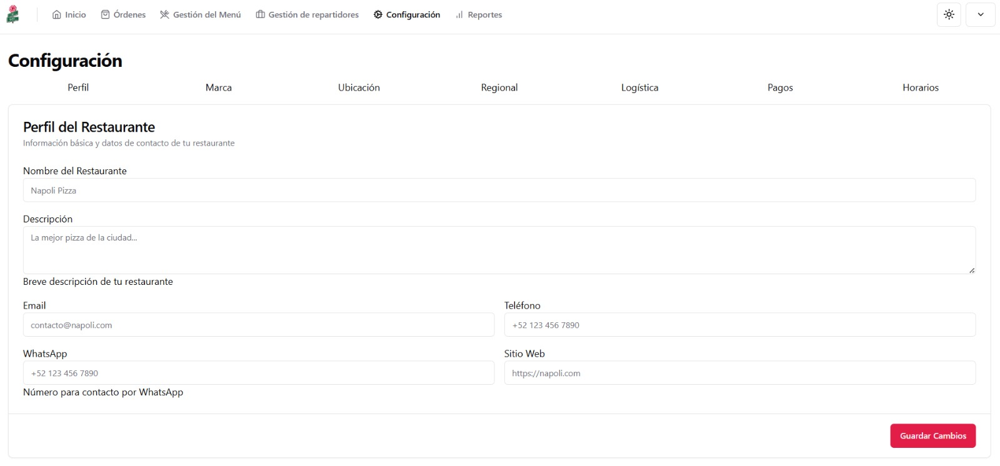
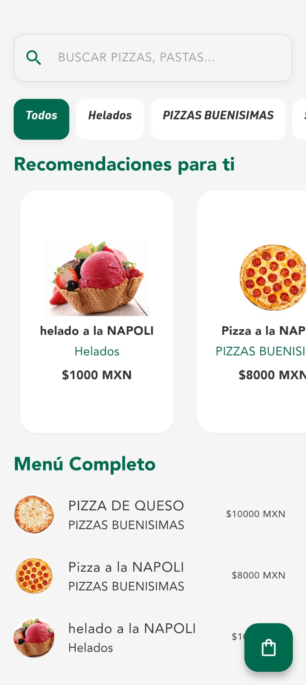
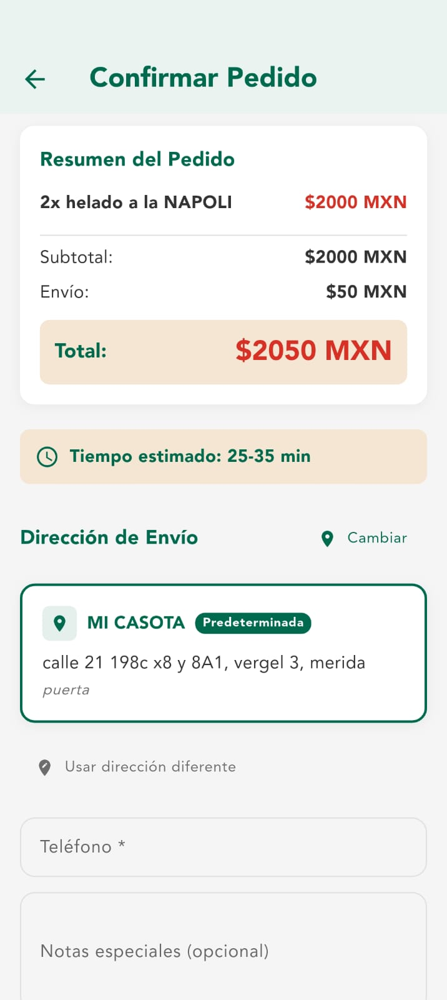
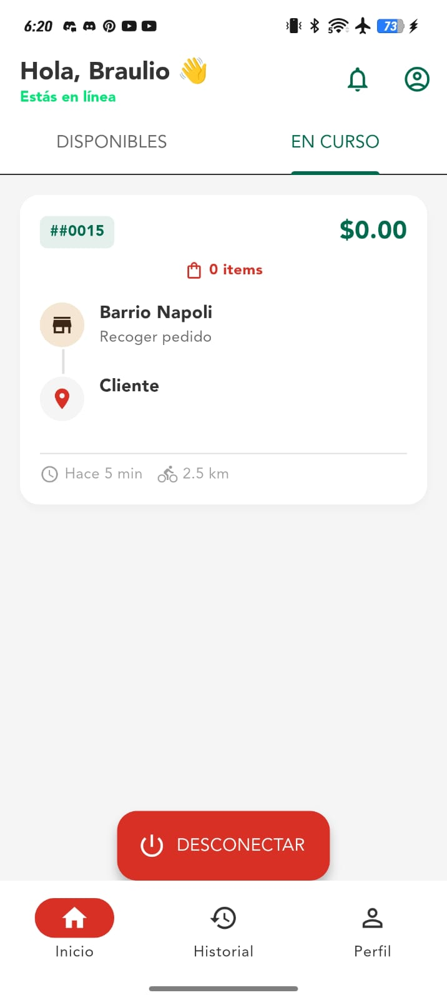

# 🍕 Napoli - Sistema Multi-Tenant de Gestión de Pizzerías

[](https://flutter.dev)
[](https://react.dev)
[](https://vitejs.dev)
[](https://supabase.com)
[](https://postgresql.org)
[](LICENSE)

<div align="center">
  
</div>

<div align="center">
  <h3>🖥️ Dashboard Web</h3>
  
  <br/>
  
  
</div>

<div align="center">
  <h3>📱 Apps Móviles (Cliente y Repartidor)</h3>
  
  
  
  
</div>

## 📋 Tabla de Contenidos

1. [Descripción Breve](#1-descripción-breve)
2. [Características Principales](#2-características-principales)
3. [Arquitectura y Stack Tecnológico](#3-arquitectura-y-stack-tecnológico)
4. [Prerrequisitos e Instalación](#4-prerrequisitos-e-instalación)
5. [Estructura de Carpetas](#5-estructura-de-carpetas)
6. [El Equipo](#6-el-equipo)
7. [Documentación y Licencia](#7-documentación-y-licencia)

---

## 1. Descripción Breve

**Napoli** es una plataforma SaaS (Software as a Service) multi-tenant diseñada para gestionar pizzerías de manera integral. El sistema resuelve el problema logístico de múltiples restaurantes, permitiéndoles operar de forma completamente independiente y segura en la misma infraestructura tecnológica (con un aislamiento de datos riguroso mediado por el `restaurant_id`).

El ecosistema abarca la gestión de administradores (menú y análisis de datos), la experiencia del cliente para realización de pedidos, y la logística de entrega con una aplicación para repartidores; manteniendo todas las partes sincronizadas en tiempo real.

---

## 2. Características Principales

- **Gestión Multi-tenant de Restaurantes**: Aislamiento total de datos. Permite administrar el menú, productos, categorías, promociones y cupones por cada pizzería de forma independiente.
- **Pedidos y Seguimiento en Tiempo Real**: Sincronización instantánea de los estados del pedido y seguimiento GPS en vivo de la entrega empleando WebSockets (Supabase Realtime).
- **Gestión Avanzada de Repartidores**: Asignación automática o manual, cálculo automatizado de ganancias, historial de métricas y sistema de calificaciones.
- **Sistema de Pagos Robusto**: Soporte de métodos de pago (Efectivo, tarjeta, transferencia) con cálculo automático y exacto (precio en centavos para evadir el error de punto flotante de variables) en subtotal, impuestos, delivery y propinas.
- **Reportes y Analíticas Offline-First**: Las aplicaciones móviles están diseñadas para preservar funcionalidades en condiciones de baja conectividad. Los administradores por su parte incluyen un dashboard con analíticas avanzadas.
- **Autenticación y Seguridad RLS**: Manejada velozmente por Supabase Auth, respaldando información delicada con Row Level Security (RLS) implementado a nivel de Postgres.

---

## 3. Arquitectura y Stack Tecnológico

El músculo técnico de Napoli es su integración perfecta de 3 aplicaciones sólidas comunicándose con un servidor unificado. Hemos implementado expresamente metodologías como **Clean Architecture**, estricta modularización, y **Principios SOLID**, garantizando abstracciones seguras frente a un código espagueti.

### Frontend (Dashboard Administrativo)
- **Framework & Lenguaje**: Vite + React 18, TypeScript, React Router DOM. *(Nota: Inicialmente referenciado como Next.js 14).*
- **Estilos & Componentes UI**: Tailwind CSS junto a shadcn/ui (Radix UI) para componentes veloces y accesibles.
- **Estado Dinámico**: React Query para manejar ciclos asíncronos y Fetching. Leaflet y Recharts para modelado de mapas e inferencia de gráficos analíticos.

### Aplicaciones Móviles (Cliente y Repartidores)
- **Framework & Lenguaje**: Flutter 3.0+, Dart.
- **Arquitectura Limpia (Clean Architecture)**: Rigurosa separación técnica en capas (`Core`, `Data`, `Domain` y `Presentation`).
- **Manejo de Estado**: Implementación del patrón de inyección de estado **BLoC** (Business Logic Component).

### Backend y Base de Datos (Supabase)
- **Base de Datos**: PostgreSQL 15+ en entorno BaaS vía Supabase.
- **Lógica Centralizada**: La mayoría de la lógica de negocio imperativa no habita en una API tradicional, se encuentra compilada usando **Stored Procedures (Pl/pgSQL)** para máximo rendimiento en la DB.
- **Aislamiento Multi-Tenant**: Fuerte uso de Row Level Security (RLS) para segregar clientes, drivers o estadísticas donde un usuario malicioso no puede pasar los límites de su propio `restaurant_id`.

---

## 🤖 Desarrollo Impulsado por Inteligencia Artificial (+IA)

Este no es un proyecto de software tradicional. **Napoli** fue orquestado y fundamentado utilizando metodologías de vanguardia en **Agentic AI Workflow** y **Prompt Engineering**. 

A través de la co-creación con avanzados modelos de Inteligencia Artificial actuando como arquitectos de co-piloto, logramos catalizar drásticamente la eficiencia del ciclo de desarrollo. Desde la estructuración de la base de datos SQL, la inferencia de políticas de seguridad multi-tenant (RLS), hasta el hilado fino de las estrictas capas de la _Clean Architecture_ en Flutter y React; la IA funcionó como una extensión de las capacidades humanas de nuestros desarrolladores. 


---

## 4. Prerrequisitos e Instalación

### Prerrequisitos
- **Node.js** v18+ (Para el panel de administración).
- **Flutter SDK** v3.0+ (Para construir Client y Courier App).
- Git.
- Entorno de desarrollo para Móviles (Android Studio o Xcode).
- Cuenta gratuita en [Supabase](https://supabase.com).

### Configuración del Servidor y Base de Datos
1. Inicia un nuevo proyecto en Supabase.
2. Ingresa al Editor SQL de tu proyecto y ejecuta los scripts de configuración que encontrarás en la carpeta `Napoli_AdminDashboard_Web`:
   - `schema.sql` (Esquema completo y lógica de negocio).
   - `rls_policies.sql` (Políticas de seguridad).
   - `storage_policies.sql` (Acceso a imágenes y buckets).
3. Asegúrese de habilitar la replicación **Realtime** en su Supabase sobre las tablas `orders`, `drivers` y `notifications`.

### Iniciar el Proyecto Localmente

```bash
# 1. Clonar el Repositorio
git clone https://github.com/IsaiasSinthesys03/Proyecto_Napoli_APPS.git
cd Proyecto_Napoli_APPS

# 2. Configurar Admin Dashboard (Frontend React/Vite)
cd Napoli_AdminDashboard_Web
npm install # o pnpm install

# Configurar credenciales (Clonar el example)
cp .env.example .env.local
# Modifica .env.local para incluir las credenciales de tu propio proyecto Supabase.

# Iniciar servidor
npm run dev
# Dashboard correrá en http://localhost:5173

# 3. Configurar Apps Móviles (Para Courier o Customer Mobile App)
cd ../Napoli_CustomerApp_Mobile
flutter pub get

# Ve al archivo designado para el SDK de Supabase:
# lib/src/core/config/supabase_config.dart
# Y añade tu supabaseUrl y supabaseAnonKey proporcionados por tu panel

# Correr en un simulador Android / IOS activo
flutter run
```

---

## 5. Estructura de Carpetas

A continuación, una mirada general a nuestra jerarquía de proyecto fundamentada bajo el principio de separación de funciones (Clean Architecture y Modularidad Frontend):

```text
Proyecto_Napoli_APPS/
├── Napoli_AdminDashboard_Web/     # SPA Web Dashboard para pizzerías.
│   ├── public/                    # Assets fijos e íconos.
│   ├── schema.sql                 # Lógica de Backend integrada a BD.
│   ├── rls_policies.sql           # Políticas estrictamente separadas.
│   └── src/
│       ├── components/            # Shadcn y abstracciones UI.
│       ├── lib/                   # Integración con el de Supabase Client.
│       └── pages/                 # Rutas orquestadas por React Router.
│
├── Napoli_CustomerApp_Mobile/     # Aplicación del Cliente final.
│   └── lib/
│       ├── src/
│       │   ├── core/              # Variables globales y Config Supabase.
│       │   ├── data/              # Repositories y Datasources (API DB).
│       │   ├── domain/            # Entities y Casos de Uso del negocio.
│       │   └── presentation/      # Estado en BLoC / Pantallas visuales.
│       └── main.dart
│
└── Napoli_CourierApp_Mobile/      # Aplicación del Repartidor.
    └── lib/
        └── src/                   # Misma filosofía Clean Architecture.
```

---

## 6. El Equipo

El desarrollo de este software fue un desafío arquitectónico masivo. Nada de esto habría sido realidad sin una dinámica real en equipo, implementando coordinación y correcta gestión de ramas funcionales.

- **Braulio Isaias Bernal Padron** - Desarrollo principal y arquitectura base.
- **Jose Gaspar Anguas Ku** - Flujos de QA, pruebas, y validaciones de implementaciones.
- **Francia Faride Ojeda Estrella** - Coordinación e integración entre interfaces funcionales.
- **Jesus Aaron Tun Can** - Soporte técnico y diseño de flujos operacionales.
- **Andri Yael Rodriguez Flota** - Lógica core y estructura en la capa de datos.

<div align="center">
  <em>Nota del equipo: Hecho con mucho esfuerzo, noches sin dormir y ansiedad.</em><br/>
  <strong>¡GASPAR ES UN MALDITO SOBREEXPLOTADOR! 😅</strong>
</div>

---

## 7. Documentación y Licencia

**Licencia:** Este proyecto se distribuye abrigado por los términos de la [Licencia MIT](LICENSE).

Si deseas esparcir y entender la forma en la que diseñamos con nuestro stack, te sugerimos leer las referencias arquitectónicas internas:
- [NAPOLI_GUIDE.md](NAPOLI_GUIDE.md): Guía maestra del flujo operacional.
- [INTEGRATION_PLAN.md](INTEGRATION_PLAN.md): Secuencia de integración.
- Y nuestros `*_ANALYSIS.md` específicos por módulo.

<br>
<div align="center">
  🍕 <strong>Napoli - Simplificando el ecosistema de envíos de pizzerías</strong>
</div>
